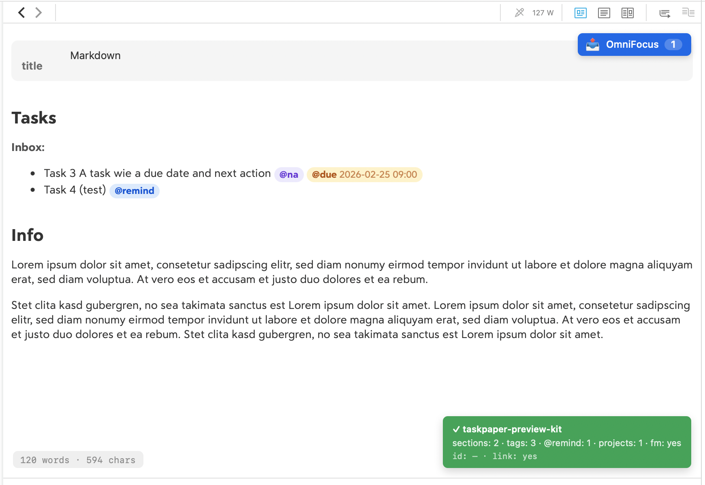

Scripts for DEVONthink (and other tools) by Ralf Hülsmann and Brett Terpstra. Stay tuned.

---

# Markdown preview with JavaScript actions

One click on the blue action button in your Markdown preview in DEVONthink sends a note's @remind tasks straight to OmniFocus (or Apple Reminders, or another app). Each task gets a backlink to the source document, so you don't have to copy and paste the link.

Underneath sits a preview script that also:
- turns TaskPaper outlines (tab-indented, which renderers dump into a code block) into real nested lists
- turns `@tags` into styled pills
- shows a live word / character count in the corner

The action behind the button is easy to point at something else. It's meant as a blueprint to build on.

The script doesn't need any CSS; it ships with its own light and dark styles.



*Example with the word count (bottom-left), debug info (bottom-right), and the
action button (top-right).*

---

## The idea

A preview can't write files, but it can fire a URL. That's how it's built:

```
  rendered Markdown  ──core──▶  transformed DOM  ──action──▶  x://url  ──▶  anything
   (any host)                    (portable)        (a swappable function)
```

The script is organized into separate sections:

| Section | Knows about | Notes |
|---|---|---|
| core | nothing but the DOM | portable; runs anywhere you can add a `<script>` |
| actions | URL schemes | swap the code and change the destination |
| adapter | DEVONthink | the host-coupled part |
| boot | your choices | the config you actually edit |

The adapter is the host-specific part, a `findBacklink()` / `findId()` pair. 

---

## Pick a task target (the "action")

Edit one line in the boot section at the bottom of `taskpaper-preview.js`. The
shipped recipes are ordered by how much you have to install:

```js
// DEFAULT — native TaskPaper straight into OmniFocus
action: TPK.actions.omnifocusPaste(),

// No dependency — every Mac/iOS has Shortcuts (see "Add Reminder.md")
action: TPK.actions.shortcutsReminder("Add Reminder"),

// One task per click instead of one batch paste
action: TPK.actions.omnifocusAdd({ autosave: true }),

// Delegate to your own CLI/handler. This one could WRITE BACK
action: TPK.actions.customScheme("milan://reminder/sync"),
```

### Why OmniFocus is the natural default

OmniFocus ingests TaskPaper syntax natively via `omnifocus:///paste`. Your
source is TaskPaper, so OmniFocus parses `@due`, `@flagged`, nesting and all by itself. The task in OmniFocus links back to the source document. 

The adapter recovers DEVONthink's record UUID straight from the preview environment. There's no official API for it. 

### Why Reminders goes through a Shortcut

Apple Reminders has no documented public URL scheme for creating reminders. Shortcuts is the supported bridge. Here is how to build the shortcut: [`Add Reminder.md`](Add%20Reminder.md).

---

## Round-trip (`@remind` → `@reminded(id)`)

A preview can only create tasks; it can't rewrite the file on disk. So with the OmniFocus and Shortcuts recipes the flow is a one-way capture. That's usually what you want (the task now lives in OmniFocus, not the note).

Write-back is a property of the action target:

| Recipe | Installs | Writes back? |
|---|---|---|
| `shortcutsReminder` (plain) | Shortcuts (built in) | no — one-way capture |
| `shortcutsReminder` → Run Shell Script | Shortcuts + a script | yes |
| `customScheme` → your CLI/daemon | your own toolchain | yes |

The last two delegate to something with file access, which scans the document for the `id`/UUID the adapter harvests and rewrites `@remind` → `@reminded(UID)`. 

---

## Install (DEVONthink)

DEVONthink just needs a path to a JavaScript file:

1. Open **DEVONthink ▸ Settings ▸ Files ▸ Markdown**.
2. Set the **JavaScript** file to this repo's `taskpaper-preview.js`.

No stylesheet is needed.

Open [`sample.md`](sample.md) in the DEVONthink preview to see every feature at once. A small green marker bottom-right confirms it loaded.

---

## Styling

The core emits semantic classes (`.md-section`, `.tag`, `.tag-arg`, `p.project`, `dl.frontmatter`) and injects minimal base styles for them, so you don't need to add any CSS. The base styles use `:where()` (zero specificity), so any rule you write wins automatically.
